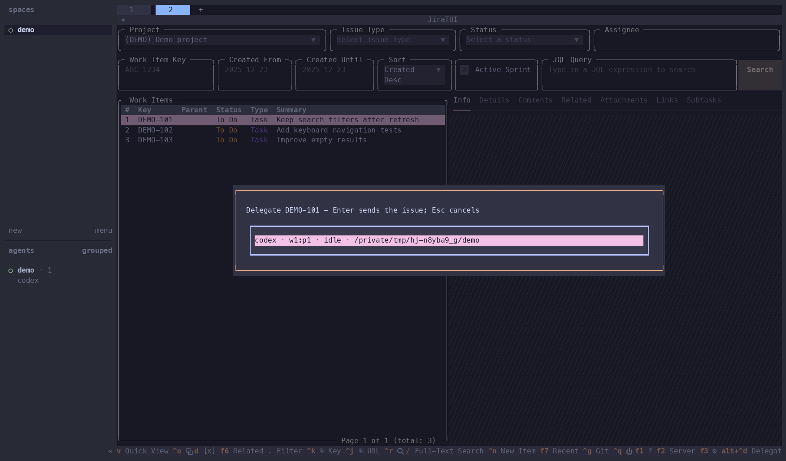

# herdr-jiratui

[JiraTUI](https://github.com/whyisdifficult/jiratui) in Herdr, with one extra shortcut: Ctrl+Alt+D sends the selected issue to a running agent.



JiraTUI handles the UI, credentials, and Jira API. This plugin adds an agent picker and sends the issue's key, summary, link, and description through `herdr agent prompt`.

## Use

Requires Herdr 0.9.3+ and [uv](https://docs.astral.sh/uv/). uv installs the project's Python version and locked dependencies when needed.

```sh
uvx jiratui configure create  # skip if JiraTUI is already configured
herdr plugin install drewbitt/herdr-jiratui
herdr plugin action invoke drewbitt.jiratui.open
```

Your existing JiraTUI config works, including `JIRA_TUI_CONFIG_FILE`. Each open action creates a tab. Select an issue and press Ctrl+Alt+D directly (Ctrl+Option+D on macOS), without Herdr's prefix. Use Up/Down to choose an idle or done agent, Enter to send, or Esc to cancel.

Herdr's default prefix is Ctrl+B: release it, then press the next key. Ctrl+B, then ? shows active [Herdr bindings](https://herdr.dev/docs/keyboard/). If your Herdr config assigns Ctrl+Alt+D to an action, remove or change that binding so the plugin receives the shortcut.

## Develop

```sh
uv sync --locked
herdr plugin link "$PWD"
uv run ruff check .
uv run ruff format --check .
uv run pytest
```

JiraTUI is pinned in `pyproject.toml` because we use its internal application and selection interfaces. Test upgrades before changing that pin. Tests cover the terminal shortcut, issue handoff, agent readiness, and failed delivery using fake Jira responses and a fake Herdr executable.

The Renovate config schedules dependency and lock-file updates for the 1st and 15th. Updates need review; JiraTUI upgrades get their own PR. CI tests Python 3.12 and the version in `.python-version`, then builds the package.

The screenshot uses fictional issues in a temporary Herdr session.
